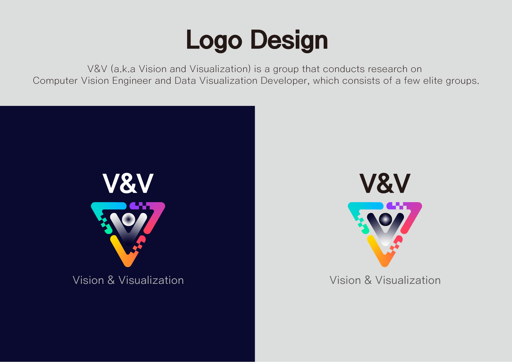
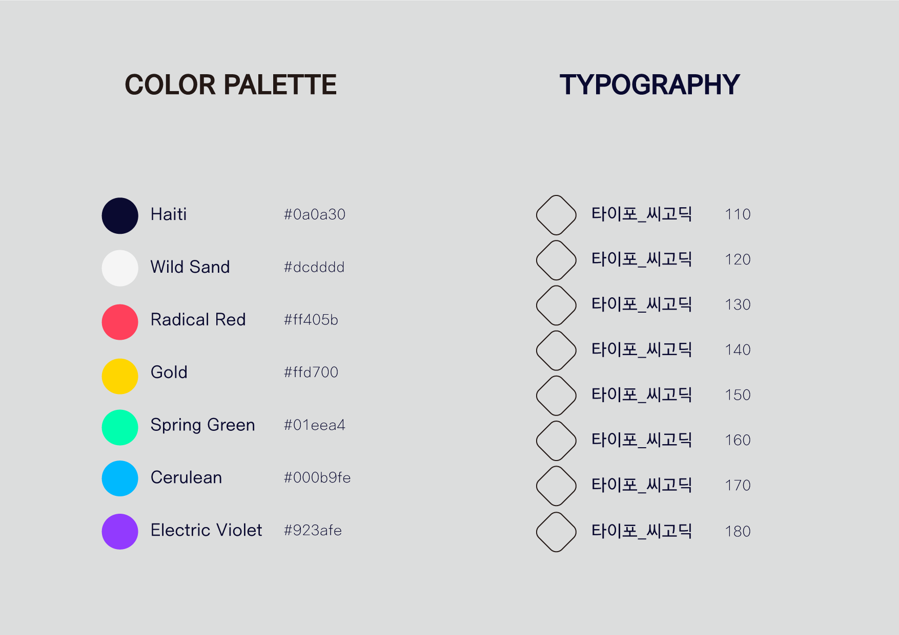
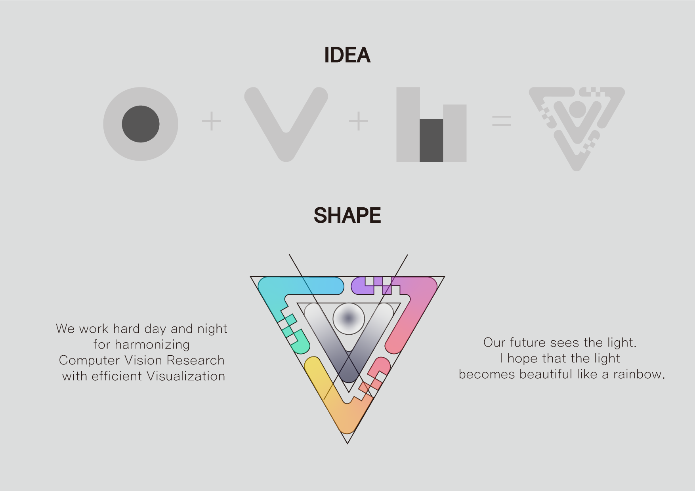

# VnV(Vision & Visualization)

We work hard day and night for harmonizing Computer Vision Research with efficient Visualization.

Our future sees the light. I hope that the light becomes beautiful like a rainbow.

V&V (a.k.a Vision and Visualization) is a group that conducts research into Computer Vision Engineer and Data Visualization Developer consisted a few elite researchers.

